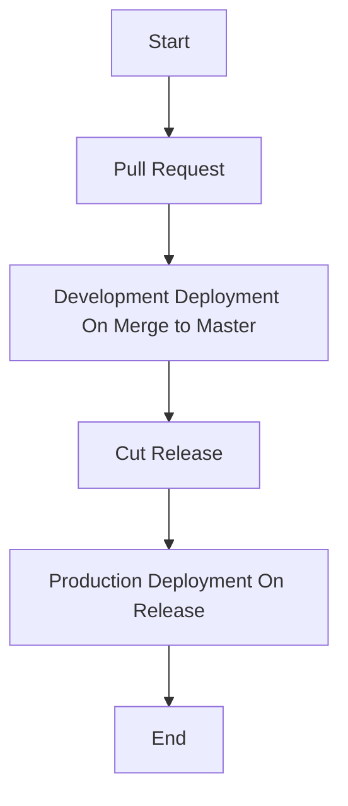

# gh-action-workflows

## Pull Request

- Adding a new workflow to the `.github/workflows` directory will automatically create a new pull request.o

## Development Deployment

- When a new release is created, the workflow will automatically deploy to development.

## Production Deployment

- When a new release is created, the workflow will automatically deploy to production.

## Pipeline Flow

