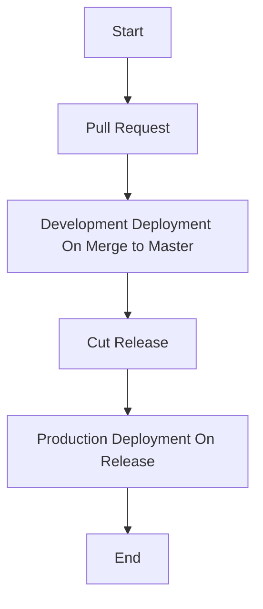

# gh-action-workflows

This repository contains GitHub Actions workflows for automating the deployment of a exmaple application to both development and production environments.

We are using [GitHub Actions](https://docs.github.com/en/actions) to automate the deployment of a example application to both development and production environments.

This is a example implementation of a CI/CD pipeline for a simple application; we are actually deploying anything here, but the idea is that you would deploy your application in these environments. Using this repository as a starting point, you can easily adapt the workflows to your own application.

## Pull Request

- Adding a new workflow to the `.github/workflows` directory will automatically create a new pull request.o

## Development Deployment On Merge to Master

- When a new release is created, the workflow will automatically deploy to development.

## Production Deployment On Release

- When a new release is created, the workflow will automatically deploy to production.

## Pipeline Flow

